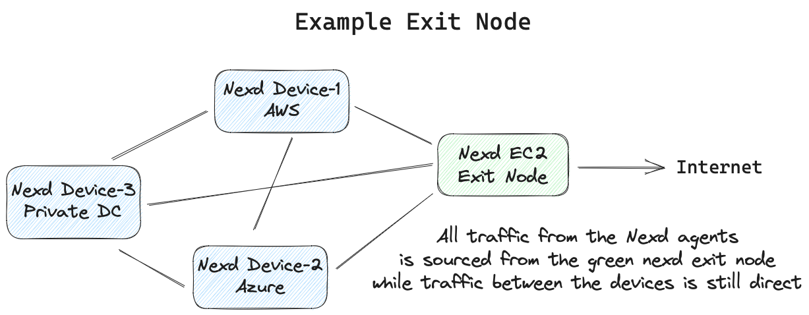

## Configuring Exit Nodes

An exit node refers to the final server or gateway through which your encrypted traffic exits or originates to for example, the Internet from the Nexodus mesh. If a user or network operator wants all the Nexodus agent's traffic to exit the VPN infrastructure through a focal point, you can configure the Nexodus mesh to funnel all traffic through an exit node. The IP address of this node is visible to the online services or websites you interact with, thus masking your actual IP address. This is how traditional hub and spoke VPNs have always operated. In a Nexodus deployment, agents peering with other agents still send traffic directly to one another if the peering is established, but the device's default routes are changed to use the Nexodus exit node.

> Note:
> The Nexodus agent has to opt into using the exit-node to avoid unintentionally oprhaning a device since we are changing default routes in multiple routing tables on the agent side. Currently, before an exit-node-client can be enabled, it requires an exit node to be available in the mesh before the configuration will be applied. This is also to avoid accidentally stranding any devices.
> This feature is currently limited to IPv4 on Linux devices, with planned multi-arch and IPv6 support.



### Exit Node Server

To enable a node to be the exit node for a VPC, use the following command. This command will advertise a default network of `0.0.0.0/0` to the VPC's peers, but only if those peers are enabled to be `--exit-node-client`s. It is important to note, that if the exit node becomes unavailable, it will also affect connectivity outside the Nexodus mesh. To return connectivity, a user can disable the `exit-node-client` with the `nexctl`` utility or restart the agent without specifying to be an exit node client.

```text
nexd router --exit-node
```

### Exit Node Client

To enable a client to use the exit node as a default origin node, simply pass the `-exit-node-client` flag at runtime.

```text
nexd --exit-node-client
```

At any time, this can be disabled using the nexctl command as follows. The exit node configuration is also removed when the nexd agent is stopped to avoid any orphaning of devices.

```text
nexctl nexd exit-node disable
```

### Enabling Exit Node Clients with Nexctl

Instead of passing the runtime flag of `--exit-node-client` at runtime, a device can be toggled to enable and disable the exit node client-side configuration. This allows for backing out the configuration or moving an exit-node to a different device.

```text
nexctl nexd exit-node enable
Successfully enabled exit node client on this device
```

View the exit nodes in your mesh with the following nexctl command. The following is an example of an exit node running in EC2.

```text
nexctl nexd exit-node list
ENDPOINT ADDRESS       PUBLIC KEY
54.197.21.59:41455     apVtJ4M7Fp4p0StwKMfnmIai2sujkyxEkVNdFpawwFE=
```

Additional details can be viewed passing a json output option.

```text
nexctl --output=json nexd exit-node list
```

Disable the exit node client configuration on a device.

```text
nexctl exit-node disable
Successfully disabled exit node client on this device
```
