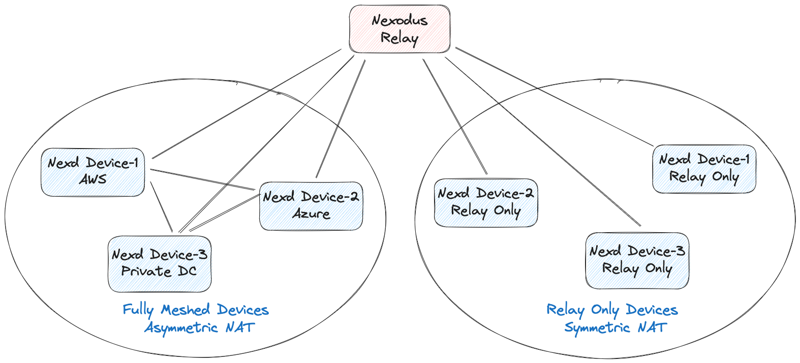

# Deploying Nexodus Relay Nodes

The Nexodus Service makes the best effort to establish direct peering between devices, but in some scenarios such as symmetric NAT, it's not possible to establish direct peering. To establish connectivity in those scenarios, the Nexodus Service uses a relay node to relay the traffic between the endpoints.

The Nexodus Service does not offer public, shared relay nodes. Instead, a relay node must be added to each VPC which requires them. Adding a relay node follows the same process as any other device but with additional options given to `nexd`.

A relay node needs to be reachable on a predictable Wireguard port such as the default UDP port of 51820. They would most commonly be run on a public IP address, though it could be anywhere reachable by all devices in the VPC. There is only a need for one relay node in a VPC.



## Setup Nexodus Relay Node

Unlike normal peering, the Nexodus relay node needs to be reachable from all the nodes that want to peer with the relay node. The default port in the following command is `51820` but a custom port can be specified using the `--listen-port` flag. Follow the instructions in [Deploying the Nexodus Agent](agent.md) instructions to set up the `nexd` binary.

To make the device a relay node, add the `relay` subcommand to the `nexd` command.

```sh
sudo nexd --service-url https://try.nexodus.127.0.0.1.nip.io relay
```

If you're using the Nexodus rpm package, edit `/etc/sysconfig/nexodus` to add the `relay` subcommand. If you're using the Nexodus deb package, edit `/etc/default/nexodus` to add the `relay` subcommand.

```sh
NEXD_ARGS="--service-url https://try.nexodus.io relay"
```
